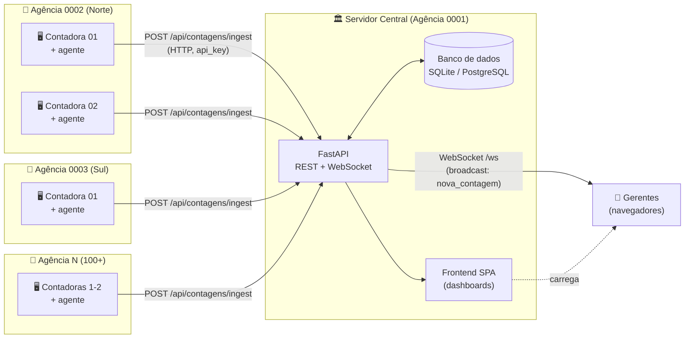
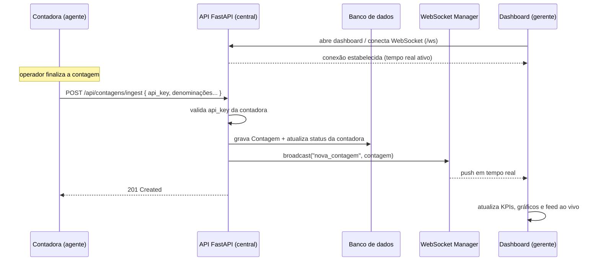
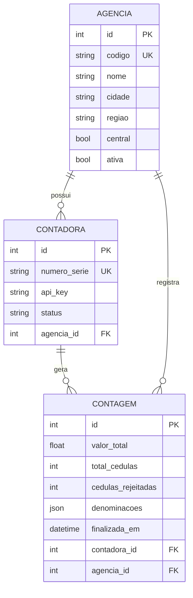

# Arquitetura — Cash Auditor

Sistema de contagem de cédulas em tempo real para um banco estadual com uma
**agência central** e **100+ agências** distribuídas. Cada agência possui de 1 a 2
**máquinas contadoras** conectadas à rede. Quando uma contadora conclui uma
contagem, o resultado é enviado automaticamente ao servidor central e exibido em
tempo real nos **dashboards** dos gerentes.

## Visão geral

## Fluxo de uma contagem em tempo real

## Componentes

| Componente | Responsabilidade | Tecnologia |
|---|---|---|
| **Agente da contadora** | Lê o resultado da máquina e faz POST autenticado para a central | Qualquer linguagem (HTTP). Simulador em Python incluso |
| **API** | REST (cadastros + ingestão) e WebSocket (broadcast) | FastAPI / Uvicorn |
| **Banco de dados** | Persiste agências, contadoras e contagens | SQLite (dev) → PostgreSQL (produção) |
| **WebSocket Manager** | Mantém dashboards conectados e transmite eventos | FastAPI WebSockets |
| **Frontend (dashboards)** | KPIs, gráficos, ranking de agências, feed ao vivo, cadastros | SPA (HTML/CSS/JS + Chart.js) |

## Modelo de dados

## Decisões de projeto

- **Autenticação das contadoras por `api_key`**: cada contadora recebe uma chave
  única no cadastro. O agente envia essa chave no POST; a central identifica a
  contadora e a agência automaticamente — não é preciso configurar IDs no campo.
- **Tempo real via WebSocket**: a ingestão grava no banco e imediatamente faz
  *broadcast* para todos os dashboards conectados, sem polling.
- **Ingestão desacoplada**: o agente da contadora pode ser escrito em qualquer
  linguagem; basta um POST HTTP. Isso facilita a integração com fabricantes
  diferentes de máquinas.
- **Banco plugável**: SQLite para desenvolvimento; em produção basta definir
  `DATABASE_URL` para um PostgreSQL (a central concentra 100+ agências).
- **Escala**: para muitas agências/instâncias, o `ConnectionManager` em memória
  pode ser trocado por um broker (Redis Pub/Sub) sem mudar o frontend.
